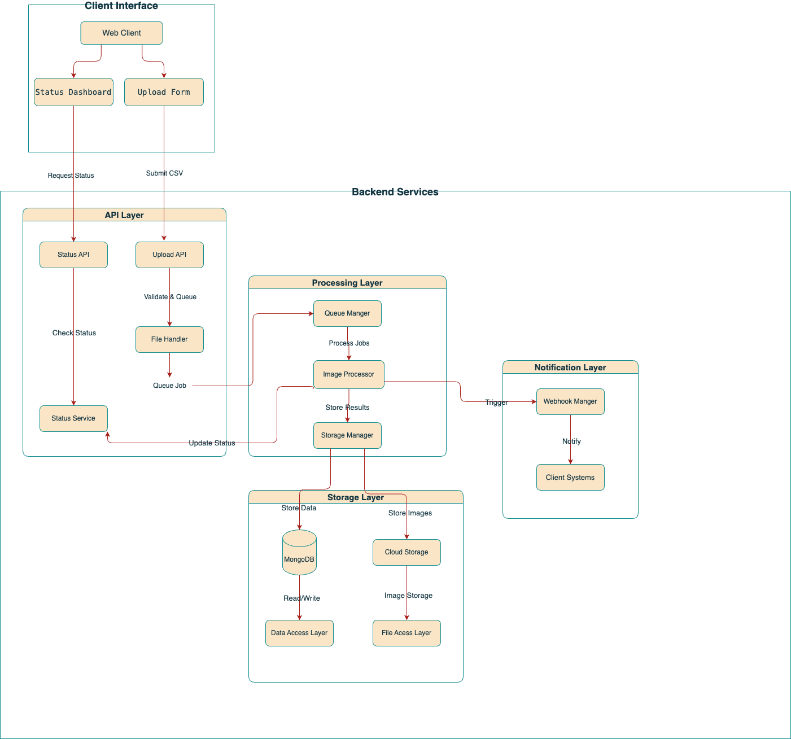

# Image Processing System

## Overview
The Image Processing System is an asynchronous, scalable service for processing images uploaded via CSV files. It supports image compression, cloud storage, and webhook notifications.

## Features
- **CSV File Upload**: Handles bulk image processing requests.
- **Asynchronous Processing**: Uses a queue-based system for efficiency.
- **Image Processing**: Downloads, compresses, and uploads images to cloud storage.
- **Webhook Support**: Sends processing results to a registered endpoint.
- **Status Tracking**: Monitors and reports processing progress.

## System Architecture


## System Components
1. **Upload Service**: Validates CSV files, creates requests, and queues jobs.
2. **Image Processor**: Downloads, compresses, and uploads images.
3. **Queue Manager**: Manages job execution, prioritization, and retries.
4. **Status Tracker**: Tracks the progress of image processing requests.
5. **Webhook Service**: Notifies external systems about completed requests.

## API Endpoints
### Upload API
```http
POST /api/upload
Content-Type: multipart/form-data
Body: CSV file
Response: {
  requestId: string,
  status: string,
  message: string
}
```

### Status API
```http
GET /api/status/:requestId
Response: {
  status: string,
  progress: number,
  products: Array<Product>
}
```

## Database Schema
### Processing Request Collection
```javascript
{
  requestId: { type: String, required: true, unique: true },
  status: { type: String, enum: ['pending', 'processing', 'completed', 'failed'] },
  createdAt: { type: Date, default: Date.now },
  completedAt: { type: Date },
  webhook: {
    url: String,
    triggered: Boolean,
    attempts: Number
  }
}
```

### Product Collection
```javascript
{
  requestId: { type: String, required: true },
  serialNumber: { type: Number, required: true },
  productName: { type: String, required: true },
  inputImageUrls: [{ type: String }],
  outputImageUrls: [{ type: String }],
  processingStatus: { type: String, enum: ['pending', 'processing', 'completed', 'failed'] }
}
```

## Error Handling
- **CSV Validation Errors**: Invalid format, missing columns, invalid URLs.
- **Image Processing Errors**: Download failures, invalid formats, upload failures.
- **Queue Management Errors**: Job timeout, max retries exceeded, queue overflow.
- **Webhook Errors**: Connection timeout, invalid response, endpoint unavailable.

## Performance Considerations
- **Queue Optimization**: Job prioritization, batch processing.
- **Resource Management**: Memory monitoring, disk space management.
- **Scaling Strategies**: Horizontal scaling, database indexing, caching.

## Security Measures
- **Input Validation**: CSV format, URL, and file size validation.
- **Authentication & Authorization**: API key validation, rate limiting.
- **Data Security**: Secure file handling, encrypted storage, secure webhook communication.

## Monitoring & Logging
- **System Metrics**: Queue size, processing time, error rates.
- **Logs**: Request/response logging, error tracking, performance monitoring.
- **Alerts**: Queue overflow, high error rates, resource constraints.
